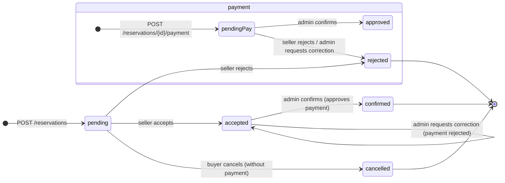

# Architecture

## Database

```mermaid
erDiagram
    users {
        int id PK
        text email UK
        text password_hash
        text phone "E.164, empty when not provided"
    }
    user_roles {
        int user_id PK_FK
        text role PK "buyer | seller"
    }
    cars {
        int id PK
        int owner_id FK
        text name
        text photo_url
        int price_per_day "in cents"
        int active "0 | 1"
    }
    reservations {
        int id PK
        int user_id FK
        int car_id FK
        text start_date "YYYY-MM-DD"
        text end_date "YYYY-MM-DD"
        text status "pending | accepted | confirmed | rejected | cancelled"
    }
    payments {
        int id PK
        int reservation_id FK, UK "one per reservation"
        text method "pos | cash"
        text status "pending | approved | rejected"
        text proof_url
    }
    revoked_tokens {
        text jti PK
        int user_id FK
        int expires_at "when the token expires"
    }

    users ||--o{ user_roles : "has roles"
    users ||--o{ reservations : "books"
    users ||--o{ cars : "publishes"
    cars ||--o{ reservations : "is booked"
    reservations ||--o| payments : "has at most one payment"
    users ||--o{ revoked_tokens : "invalidated tokens"
```

What matters about the schema (`internal/db/migrations/`):

- `users.email` is unique (case-insensitive). Roles live in `user_roles` (`buyer`, `seller`, `admin`): every account is at least a buyer and can add seller (migration 00008); `admin` comes from the `ADMIN_EMAILS` allow-list only (migration 00009, `auth.SyncAdminRoles` at startup plus grant on registration, no API can grant it).
- `users.phone` stores E.164 (migration 00006, with a `CHECK`), empty when the user did not provide one; it is required to become a seller (either by registering with `phone` or through `POST /auth/become-seller`).
- `cars.owner_id` says who owns the car. `price_per_day` in cents, `0..100_000_000` with a DB `CHECK` (migration 00005).
- Reservations have `CHECK(end_date >= start_date)` in the DB.
- A reservation has **at most one payment** (`payments.reservation_id` is unique).
- `revoked_tokens` stores the `jti` of access tokens closed through `/auth/logout` and of refresh tokens already rotated in `/auth/refresh`. An internal job deletes the expired ones every 10 minutes.
- `users.token_valid_after` invalidates every token issued before that instant; it is raised on a password change and when a reused refresh is detected, killing all of the user's sessions at once.
- Dates are stored as `YYYY-MM-DD` text.
- Migrations are embedded in the binary and applied on startup. Only the pending ones run.

## How SQLite behaves here

- It opens with **WAL**, waits up to 5 seconds if the database is busy and uses up to 8 connections (1 for `:memory:`) with `MaxIdleTime` 5 min / `MaxLifetime` 30 min.
- Operations that touch several tables use `BEGIN IMMEDIATE` so two reservations cannot collide at the same time.
- Contention is answered, not hidden: a write that still finds the database busy after the 5 s timeout answers `503` with `Retry-After` (retry the request), never `500`. Only `/health` has a degraded mode; writes just ask to come back.
- `synchronous=NORMAL` (what SQLite recommends with WAL): if the process dies nothing is lost. If the database is busy while migrating, it retries with backoff (up to 5 times).
- There are indexes on `cars(owner_id)`, `reservations(user_id)` and `reservations(car_id, start_date, end_date)` so lookups stay fast.

## Reservation states



- A reservation is born `pending`. The buyer can cancel it while it is still `pending` and has no payment. The owner accepts it (`accepted`) or rejects it (`rejected`, releasing the dates); only an `accepted` reservation with a validated payment becomes `confirmed`, and only through the administrator.
- A payment is born `pending` and becomes `approved` when the administrator confirms, or `rejected` when the owner rejects the request or the administrator sends it back for correction. A rejected reservation is terminal, but a correction keeps the reservation `accepted` so the buyer attaches a new proof without booking again.

The legal transitions, with who performs them:

| From | To | Who | Endpoint |
|------|----|-----|----------|
| — | `pending` | any authenticated buyer | `POST /reservations` |
| `pending` | `accepted` | owner (seller) | `PATCH /seller/reservations/{id}/accept` |
| `pending` | `rejected` | owner (seller) | `PATCH /seller/reservations/{id}/reject` (pending payment is rejected too) |
| `pending` | `cancelled` | buyer who booked | `PATCH /reservations/{id}/cancel` (only without payment) |
| `accepted` | `confirmed` | admin | `PATCH /admin/reservations/{id}/confirm` (requires a `pending` payment, approved atomically) |
| `accepted` | `accepted` | admin | `PATCH /admin/reservations/{id}/request-correction` (payment `pending` → `rejected`, buyer re-attaches) |

There is no other edge: no `pending → confirmed`, no `accepted → rejected/cancelled`, no admin hard-reject, and `confirmed`/`rejected`/`cancelled` are terminal. The guards live in the handlers inside `WithImmediateTx` (SELECT-guard + conditional `UPDATE`); the database only enforces membership (`CHECK`) plus `UNIQUE(reservation_id)` on payments, so any future writer must go through the same endpoints.

Blocking has three deliberate strictness levels for three different questions:

- **Booking / availability:** `pending`, `accepted` and `confirmed` block dates (`NOT IN (cancelled, rejected)`, shared `db.OverlapPredicate`).
- **Deactivation:** same blocking set, but only reservations ending today or later (`end_date >= today` in the business time zone, `BUSINESS_TIMEZONE`); history never blocks deactivation. The admin override skips this guard on purpose.
- **Deletion:** any reservation in history blocks it (seller and admin alike); only a car that never had reservations can be deleted.

## Business rules

**Availability:**

- Only cars with `active = 1` count.
- Two reservations collide if `r.start_date <= end AND r.end_date >= start`, as long as neither is `cancelled` nor `rejected`.
- `start_date` cannot be before today (in the business time zone, `BUSINESS_TIMEZONE`, default `America/Managua`) and `end_date >= start_date`.
- A reservation cannot last more than **30 days**.
- Listings are plain arrays and can be paginated with `limit`/`offset`.

**Validations:**

- The body cannot exceed **1 MB**. Malformed JSON or fields that do not exist answer `400`. Going over the size answers `413`.
- `price_per_day` between `0` and `100_000_000` cents. `name` up to 200 characters.
- `photo_url` and `proof_url`, when present, must be `http(s)` URLs of up to 2048 characters.
- Emails: lowercased and limited to 254 characters (format validated: no dots/hyphens on the edges, no consecutive `..`, TLD of at least 2 letters). Passwords: 8 to 72.

**All or nothing:**

- Creating a reservation, paying, cancelling and confirming all happen inside a transaction. If anything fails, nothing is left half-done.

**Privacy:**

- If you try to read or touch something that is not yours, the API answers `404` as if it did not exist. Registration answers `201` whether the email exists or not, to avoid revealing which addresses are registered.

## Module map

Separation rule: `handlers` speaks HTTP (request parsing, status codes, JSON
shape), `db` owns SQL execution and transactions, `internal/httpx` owns the
error envelope. Anything that does not touch `http.ResponseWriter` lives
outside the handler file for its domain.

`internal/handlers/` layout:

- `api.go` — the `API` dependencies struct and constructor.
- `routes.go` / `router.go` / `cors.go` / `middleware.go` — the route table
  (single source of truth), the production chain, CORS and middlewares.
- `http_json.go` — JSON envelope, body size limit and strict decoding.
- `pagination.go` — `limit`/`offset` parsing and defaults.
- `filters.go` — the shared `WHERE` builder for filtered listings.
- `validate.go` — field caps, `lenBetween`, URL and `/uploads/` path checks.
- `dbhelpers.go` — the shared `rowScanner` shape and SQLite error codes.
- `dates.go` — `YYYY-MM-DD` parsing, today bound and the rental length cap.
- `auth.go` (+ `phone.go`) — registration, login, tokens, profile.
- `cars.go` + `cars_validate.go` + `cars_query.go` — catalog endpoints,
  field validators and row scanning.
- `reservations.go` + `reservations_query.go` — booking endpoints, the
  reservation view and its scan helper.
- `seller_review.go` — the owner's accept/reject of a request.
- `admin_confirm.go` — the administrator's confirm/request-correction.
- `payments.go` + `payments_validate.go` — payment endpoints and their checks.
- `notifications.go` + `admin_notifications.go` — in-app notification fan-out
  on every transition, plus the user and admin listings.
- `uploads.go` + `uploads_files.go` — upload/serve/cleanup endpoints plus
  image re-encoding and disk-usage helpers.
- `admin_*.go` — one file per admin domain: `audit` (log + helper),
  `users`, `cars`, `reservations`, `payments`, `notifications`, `stats`
  (the confirm/request-correction flow lives in `admin_confirm.go` above).

`internal/db/tx.go` exposes `WithImmediateTx`: callbacks return business-rule
outcomes as errors and the handler maps them to HTTP once, outside the
transaction; handlers never open transactions by hand and never write
responses from inside one.

## Server and logs

- Timeouts: header 5 s, read 10 s, write 120 s (generous so a 5 MB upload gets through from a slow link), idle 60 s. Max header 1 MB.
- Every request leaves a log line with method, path, status and duration; if the caller sends `X-Request-Id` it is included for correlation.
- `GET /health` answers `{"status":"ok","version":"..."}` (or `503 degraded` if the database does not answer); the version is injected by `make build`. On `SIGINT`/`SIGTERM` it shuts down cleanly in up to 10 s.
