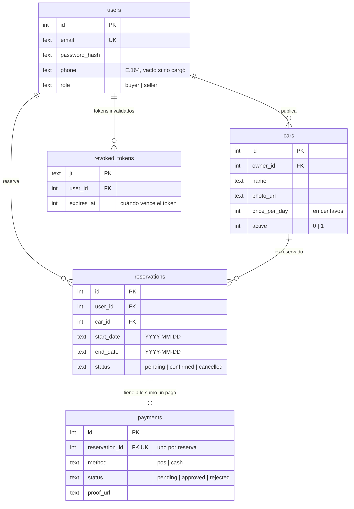
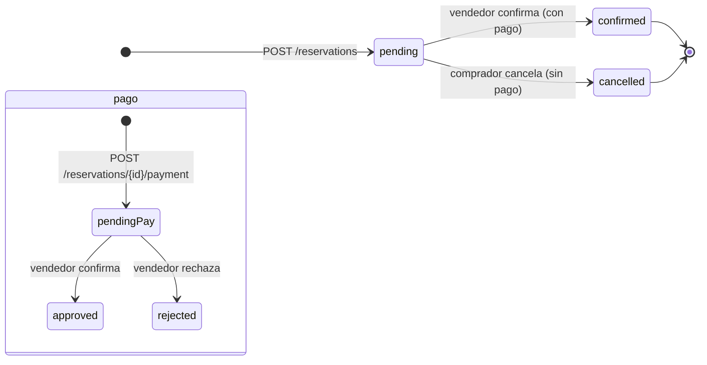

# Arquitectura

## Base de datos

Lo importante del esquema (`internal/db/migrations/`):

- `users.email` es único (sin distinguir mayúsculas/minúsculas). `role` solo puede ser `buyer` o `seller`.
- `users.phone` guarda E.164 (migración 00006, con `CHECK`), vacío si el usuario no cargó uno; es obligatorio para vendedores al registrarse.
- `cars.owner_id` dice quién es el dueño del auto. `price_per_day` en centavos, `0..100_000_000` con `CHECK` en DB (migración 00005).
- Las reservas tienen `CHECK(end_date >= start_date)` en DB.
- Una reserva tiene **a lo sumo un pago** (`payments.reservation_id` es único).
- `revoked_tokens` guarda los `jti` de access tokens cerrados con `/auth/logout` y de refresh tokens ya rotados en `/auth/refresh`. Un proceso interno borra cada 10 minutos los que ya vencieron.
- `users.token_valid_after` invalida todos los tokens emitidos antes de ese instante; se alza al cambiar la contraseña y al detectar un refresh reutilizado, y mata todas las sesiones del usuario a la vez.
- Las fechas se guardan como texto `YYYY-MM-DD`.
- Las migraciones están embebidas en el binario y se aplican al arrancar. Solo se ejecutan las que faltan.

## Cómo funciona SQLite acá

- Se abre con **WAL**, espera hasta 5 segundos si la base está ocupada y usa hasta 8 conexiones (1 si es `:memory:`) con `MaxIdleTime` 5 min / `MaxLifetime` 30 min.
- Las operaciones que tocan varias tablas usan `BEGIN IMMEDIATE` para que dos reservas no choquen al mismo tiempo.
- `synchronous=NORMAL` (lo que recomienda SQLite con WAL): si se cae el proceso no se pierde nada. Si al migrar la base está ocupada, reintenta con backoff (hasta 5 veces).
- Hay índices en `cars(owner_id)`, `reservations(user_id)` y `reservations(car_id, start_date, end_date)` para que las búsquedas sean rápidas.

## Estados de una reserva

- Una reserva nace `pending`. El comprador puede cancelarla mientras siga `pending` y no tenga pago. El vendedor la confirma y pasa a `confirmed` (y el pago a `approved`).
- Un pago nace `pending` y pasa a `approved` al confirmar, o a `rejected` si el vendedor lo rechaza: la reserva queda `cancelled` y las fechas se liberan. Como solo puede haber un pago por reserva, después del rechazo el comprador crea una nueva reserva.

## Reglas del negocio

**Disponibilidad:**

- Solo cuentan autos con `active = 1`.
- Dos reservas chocan si `r.start_date <= fin AND r.end_date >= inicio`, siempre que ninguna esté `cancelled`.
- `start_date` no puede ser anterior a hoy (en UTC) y `end_date >= start_date`.
- Una reserva no puede durar más de **30 días**.
- Las listas son arrays simples y se pueden paginar con `limit`/`offset`.

**Validaciones:**

- El body no puede pasar de **1 MB**. Si mandas JSON mal formado o campos que no existen, responde `400`. Si te pasas del tamaño, `413`.
- `price_per_day` entre `0` y `100_000_000` centavos. `name` hasta 200 caracteres.
- `photo_url` y `proof_url`, si van, deben ser URLs `http(s)` de hasta 2048 caracteres.
- Emails: se pasan a minúsculas y se limitan a 254 caracteres (formato validado: sin puntos/guiones en bordes, sin `..` seguidos, TLD de al menos 2 letras). Passwords: 8 a 72.

**Todo o nada:**

- Crear reserva, pagar, cancelar y confirmar se hacen dentro de una transacción. Si algo falla, no queda nada a medias.

**Privacidad:**

- Si intentas ver o tocar algo que no es tuyo, la API responde `404` como si no existiera. El registro responde `201` igual exista o no el email, para no revelar registros.

## Server y logs

- Timeouts: header 5 s, lectura 10 s, escritura 120 s (holgado para que una subida de 5 MB entre desde un link lento), idle 60 s. Header máximo 1 MB.
- Cada request deja una línea de log con método, ruta, status y duración; si manda `X-Request-Id` se incluye para correlación.
- `GET /health` responde `{"status":"ok","version":"..."}` (o `503 degraded` si la base no responde); la versión se inyecta con `make build`. Al recibir `SIGINT`/`SIGTERM` apaga limpio en hasta 10 s.

## Qué no hace todavía (MVP)

Pasarela de pago, WhatsApp, frontend, límite distribuido entre varios servers, y rechazar pagos.
