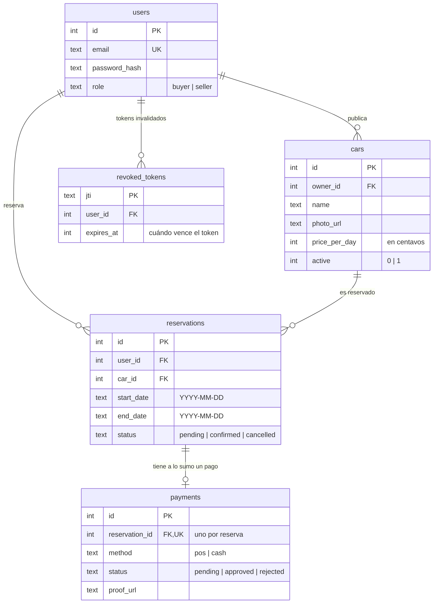
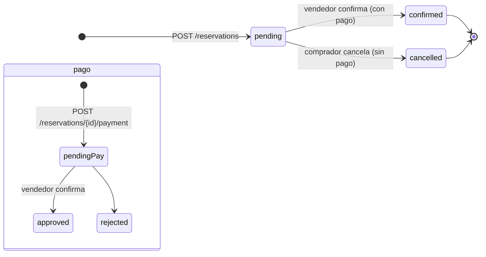

# Arquitectura

## Con qué está hecho

- **Go 1.26.5** con librería estándar: `net/http`, `database/sql`, `log/slog`.
- **SQLite** embebido con `modernc.org/sqlite` (no necesita nada instalado en el sistema).
- **Migraciones** con `pressly/goose/v3`: SQL versionado que se aplica solo al arrancar. Quedan registradas en `goose_db_version` y nunca borran datos.
- **Límite de intentos** con `golang.org/x/time/rate` (por IP, solo en `/auth/*`).
- **CORS** con `rs/cors`.
- **JWT HS256** y **bcrypt** para auth.

No hay framework ni ORM: handlers HTTP puros y SQL directo.

## Cómo está organizado

```
cmd/api/                  # arranca el server, configura middleware y apaga limpio
internal/
  config/                 # lee y valida variables de entorno
  db/                     # abre SQLite y aplica migraciones
  auth/                   # contraseñas, tokens y middleware de login/roles
  models/                 # tipos del dominio (User, Car, Reservation, Payment)
  handlers/               # rutas y lógica de cada endpoint
  ratelimit/              # límite por IP
scripts/                  # dev.sh y demo.sh
bruno/                    # colección para probar la API con Bruno
```

## Base de datos



Lo importante del esquema (`internal/db/migrations/`):

- `users.email` es único (sin distinguir mayúsculas/minúsculas). `role` solo puede ser `buyer` o `seller`.
- `cars.owner_id` dice quién es el dueño del auto. `price_per_day` en centavos, `0..100_000_000` con `CHECK` en DB (migración 00005).
- Las reservas tienen `CHECK(end_date >= start_date)` en DB.
- Una reserva tiene **a lo sumo un pago** (`payments.reservation_id` es único).
- `revoked_tokens` guarda los tokens que se cerraron con `/auth/logout`. Un proceso interno borra cada 10 minutos los que ya vencieron.
- Las fechas se guardan como texto `YYYY-MM-DD`.
- Las migraciones están embebidas en el binario y se aplican al arrancar. Solo se ejecutan las que faltan.

## Cómo funciona SQLite acá

- Se abre con **WAL**, espera hasta 5 segundos si la base está ocupada y usa hasta 8 conexiones (1 si es `:memory:`) con `MaxIdleTime` 5 min / `MaxLifetime` 30 min.
- Las operaciones que tocan varias tablas usan `BEGIN IMMEDIATE` para que dos reservas no choquen al mismo tiempo.
- `synchronous=NORMAL` (lo que recomienda SQLite con WAL): si se cae el proceso no se pierde nada. Si al migrar la base está ocupada, reintenta con backoff (hasta 5 veces).
- Hay índices en `cars(owner_id)`, `reservations(user_id)` y `reservations(car_id, start_date, end_date)` para que las búsquedas sean rápidas.

## Estados de una reserva



- Una reserva nace `pending`. El comprador puede cancelarla mientras siga `pending` y no tenga pago. El vendedor la confirma y pasa a `confirmed` (y el pago a `approved`).
- Un pago nace `pending` y pasa a `approved` al confirmar. `rejected` existe en el esquema pero no tiene endpoint todavía.

## Reglas del negocio

**Disponibilidad:**

- Solo cuentan autos con `active = 1`.
- Dos reservas chocan si `r.start_date <= fin AND r.end_date >= inicio`, siempre que ninguna esté `cancelled`.
- `start_date` no puede ser anterior a hoy (en UTC) y `end_date >= start_date`.
- Una reserva no puede durar más de **30 días**.
- Las listas son arrays simples y se pueden paginar con `limit`/`offset`.

**Validaciones:**

- El body no puede pasar de **1 MB**. Si mandas JSON mal formado o campos que no existen, responde `400`. Si te pasas del tamaño, `413`.
- `price_per_day` entre `0` y `100_000_000` centavos. `name` hasta 200 caracteres.
- `photo_url` y `proof_url`, si van, deben ser URLs `http(s)` de hasta 2048 caracteres.
- Emails: se pasan a minúsculas y se limitan a 254 caracteres. Passwords: 8 a 72.

**Todo o nada:**

- Crear reserva, pagar, cancelar y confirmar se hacen dentro de una transacción. Si algo falla, no queda nada a medias.

## Login y permisos

- Registro público: `POST /auth/register` (comprador) y `POST /auth/register/seller` (vendedor).
- Login devuelve un par **JWT HS256**: access de **15 min** y refresh de **7 días** (un solo uso, con rotación vía `POST /auth/refresh`), con `uid`, `role`, `iss`, `aud`, `jti`, `iat`, `exp` y `sub`. El server rechaza tokens con otro algoritmo (incluido `none`), sin `exp`/`iss`/`aud` o con firma inválida. Si el email no existe igual hace un `bcrypt` dummy para que no se pueda adivinar por tiempo de respuesta.
- `POST /auth/logout` guarda el `jti` en `revoked_tokens`. Ese token deja de funcionar (responde `401` igual que uno vencido). Otros tokens del mismo usuario siguen valiendo.
- `Authorization: Bearer <token>` en toda ruta protegida.
- `RequireAuth` y `RequireRole("seller")` verifican el token, buscan al usuario y lo ponen en el contexto. Además, cada operación verifica que el recurso sea tuyo: si no lo es, responde `404`.

### Quién puede hacer qué

| Recurso | Comprador | Vendedor | Sin login |
|---------|-----------|----------|-----------|
| `GET /cars` | sí | sí | sí |
| `POST /auth/register*`, `POST /auth/login` | sí | sí | sí |
| `GET /auth/me` | su perfil | su perfil | no (401) |
| `POST /auth/logout` | sí | sí | no (401) |
| `GET /seller/cars`, `POST /seller/cars` | no (403) | solo sus autos | no (401) |
| `PATCH /seller/cars/{id}` | no (403) | solo sus autos | no (401) |
| `POST /reservations`, `GET /reservations` | sí (sus reservas) | sí (si reservó) | no (401) |
| `GET /reservations/{id}` | sus reservas | dueño del auto | no (401) |
| `PATCH /reservations/{id}/cancel` | sus reservas | su reserva | no (401) |
| `POST /reservations/{id}/payment` | sus reservas | su reserva | no (401) |
| `GET /seller/reservations` | no (403) | sus autos | no (401) |
| `PATCH /seller/reservations/{id}/confirm` | no (403) | dueño del auto | no (401) |

## Límite de intentos

- En rutas `/auth/*` (auth) por IP: **30 por minuto** (0.5/s, ráfaga 30).
- En escritura `POST /reservations`, `POST /seller/cars`, `POST /reservations/*/payment`: **120 por minuto** (2/s, ráfaga 20).
- Si te pasas → `429 {"error":"too many requests"}`.
- Es en memoria, por proceso. Los contadores se borran tras 10 min sin uso.

## Server y logs

- Timeouts: header 5 s, lectura 10 s, escritura 30 s, idle 60 s. Header máximo 1 MB.
- Cada request deja una línea de log con método, ruta, status y duración; si manda `X-Request-Id` se incluye para correlación. Headers de seguridad en cada respuesta (`nosniff`, `DENY`, `Referrer-Policy`, `HSTS` si TLS).
- Si algo hace panic, se captura y responde `500 {"error":"server error"}`.
- `GET /health` responde `{"status":"ok","version":"..."}` (o `503 degraded` si la base no responde). La versión se inyecta con `make build`.
- Al recibir `SIGINT`/`SIGTERM` apaga limpio en hasta 10 s.

## Qué no hace todavía (MVP)

Subida real de imágenes, pasarela de pago, WhatsApp, frontend, límite distribuido entre varios servers, y rechazar pagos.
