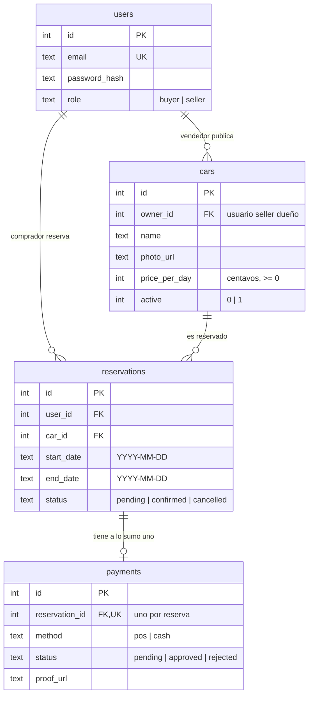
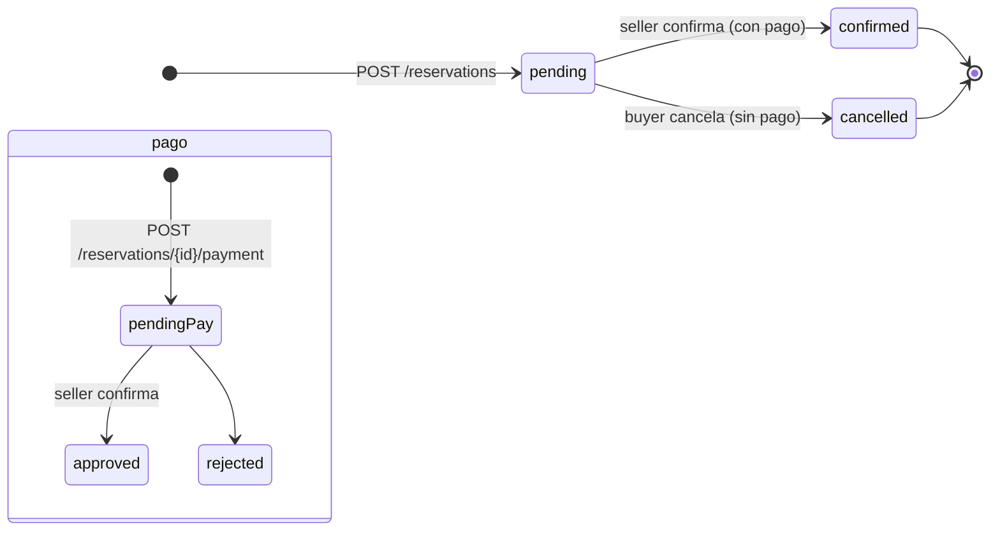

# Arquitectura

## Stack

- **Go 1.26** con la librería estándar: `net/http` (con las rutas con `Method` y
  placeholders, p. ej. `"PATCH /seller/cars/{id}"`), `database/sql` y `log/slog`.
- **SQLite** embebido vía `modernc.org/sqlite` (implementación 100% Go, no
  requiere CGO ni binarios externos).
- **Migraciones** con `pressly/goose/v3`: SQL versionado embebido en el binario
  (`internal/db/migrations/`) y aplicado al arrancar; la tabla `goose_db_version`
  guarda el historial y las migraciones **nunca borran datos**.
- **Rate limit** con `golang.org/x/time/rate` (token bucket audited), con una
  capa propia keyed por IP.
- **CORS** con `rs/cors` (`internal/handlers/cors.go`).
- **Config** con `caarlos0/env/v11` (tags de struct + defaults).
- **JWT HS256** (`golang-jwt/jwt/v5`) y **bcrypt** (`golang.org/x/crypto`).
- **godotenv** (`joho/godotenv`) para cargar `.env` de forma opcional.

No hay framework web ni ORM: los handlers son `http.HandlerFunc` puros y las
consultas son SQL directo.

## Layout del repositorio

```
cmd/api/                  # main: configuración, servidor, middleware, graceful shutdown
internal/
  config/                 # carga tipada y validación de variables de entorno
  db/                     # conexión SQLite, migraciones goose, predicado de overlap
  auth/                   # bcrypt, JWT, middleware de autenticación y roles
  models/                 # tipos de dominio compartidos (User, Car, Reservation, Payment)
  handlers/               # API, rutas, middleware HTTP y handlers por recurso
  ratelimit/              # token bucket (x/time/rate) limitado por IP
scripts/                  # dev.sh y demo.sh
bruno/                    # colección API para Bruno
```

## Modelo de datos



Puntos clave del esquema (`internal/db/migrations/`):

- `users.email` es único; `role` solo admite `buyer` (comprador) y `seller`
  (vendedor). No existe cuenta admin global: cada vendedor es dueño de sus autos.
- `cars.owner_id` apunta al `users.id` del vendedor que lo publica (NOT NULL).
- `cars.price_per_day` está en **centavos** (entero) y no puede ser negativo.
- `payments.reservation_id` es único: **una reserva tiene a lo sumo un pago**.
- Las fechas son strings ISO `YYYY-MM-DD` en texto.
- El esquema se gestiona con **migraciones goose** (`internal/db/migrations/*.sql`),
  embebidas con `go:embed` y aplicadas al arrancar (`db.Open`). goose registra el
  historial en `goose_db_version`; solo se aplican las pendientes y **los datos
  nunca se borran**.

## Máquina de estados



- Una reserva nace en `pending`; el vendedor la confirma con `confirmed` tras
  aprobar el pago, o el comprador la cancela (`cancelled`) con
  `PATCH /reservations/{id}/cancel` mientras esté `pending` y sin pago.
- Un pago nace en `pending`; pasa a `approved` cuando el vendedor confirma la
  reserva. Un pago `rejected` no tiene endpoint en el MVP.

## Reglas de dominio

Disponibilidad y solapamiento (`GET /cars`, `POST /reservations`):

- Solo se consideran autos con `active = 1`.
- Dos reservas solapan si `r.start_date <= fin AND r.end_date >= inicio`, siempre
  que ninguna esté `cancelled` (el overlap se evalúa con
  [`db.OverlapPredicate`](../internal/db/db.go)); las `cancelled` **no** bloquean.
- `start_date` no puede ser anterior a hoy (comparación UTC) y
  `end_date >= start_date`.
- El rango de una reserva no puede superar los **30 días**
  (`end_date - start_date <= 30 días`); las listas devuelven un array plano y
  aceptan `limit`/`offset` para paginar (ver [00-general](api/00-general.md)).

Validaciones de entrada:

- El body se limita a **1 MB** y es JSON estricto: campos desconocidos o JSON
  inválido → `400 "invalid JSON body"`; exceso de tamaño → `413`.
- `price_per_day` en el rango `0..100_000_000` centavos.
- `photo_url` y `proof_url`, si se envían, deben ser URLs HTTP/HTTPS válidas.
- Los emails se normalizan a minúsculas (trim incluido).
- El password mínimo es de 6 caracteres.

Operaciones atómicas:

- `POST /reservations` y `PATCH /seller/reservations/{id}/confirm` corren dentro
  de una transacción `BEGIN IMMEDIATE` (SQLite) para evitar carreras.

## Autenticación y autorización

- El registro es público: `POST /auth/register` crea cuentas `buyer` y
  `POST /auth/register/seller` cuentas `seller` (un vendedor gestiona **sus**
  autos).
- El login valida credenciales (bcrypt) y emite un **JWT HS256 de 24 h** con
  los claims `uid` (id de usuario) y `role`.
- `Authorization: Bearer <token>` en toda ruta protegida.
- Los middleware `RequireAuth` y `RequireRole` resuelven el usuario desde el
  token, lo cargan en la base y lo inyectan en el contexto de la request.
- Las rutas de vendedor usan `Auth.RequireRole("seller", handler)` declarado en
  `Routes`, **y** verifican ownership por fila: `PATCH /seller/cars/{id}` y
  `PATCH /seller/reservations/{id}/confirm` solo operan sobre autos del vendedor
  autenticado (si no, `404`). `GET /reservations/{id}` habilita al vendedor
  dueño del auto, además del comprador que reservó.

### Permission matrix

| Recurso | Comprador (`buyer`) | Vendedor (`seller`) | Anónimo |
|---------|--------------------|--------------------|---------|
| `GET /cars` | sí | sí | sí |
| `POST /auth/register*`, `POST /auth/login` | sí | sí | sí |
| `GET /auth/me` | su perfil | su perfil | no (401) |
| `GET /seller/cars`, `POST /seller/cars` | no (403) | **solo sus autos** | no (401) |
| `PATCH /seller/cars/{id}` | no (403) | **solo sus autos** | no (401) |
| `POST /reservations`, `GET /reservations` | sí (sus reservas) | sí (si reserva) | no (401) |
| `GET /reservations/{id}` | sus reservas | **dueño del auto** | no (401) |
| `PATCH /reservations/{id}/cancel` | **sus reservas** | su reserva | no (401) |
| `POST /reservations/{id}/payment` | **sus reservas** | su reserva | no (401) |
| `GET /seller/reservations` | no (403) | **sus autos** | no (401) |
| `PATCH /seller/reservations/{id}/confirm` | no (403) | **dueño del auto** | no (401) |

## Rate limiting

- Token bucket **en memoria** (`golang.org/x/time/rate`), por IP
  (`RemoteAddr` sin puerto), solo para rutas cuyo path empieza por `/auth/`.
- Configuración actual: refill de `0.5` tokens/s (**30 por minuto**), ráfaga de
  `30`; sobre el límite → `429 {"error":"too many requests"}`.
- Es un límite de un solo proceso: **no es distribuido**. Los buckets expiran
  tras 10 min sin uso (GC cada minuto).

## Server y observabilidad

- `http.Server` con timeouts razonables (read header 5 s, read 10 s, write 30 s,
  idle 60 s) y `MaxHeaderBytes` 1 MB.
- `WithRequestLog` registra una línea por request con método, path, status y
  duración en ms usando `log/slog` (formato texto).
- `GET /health` responde `{"status":"ok","version":"..."}` tras hacer ping a la
  base (`503 degraded` si falla). La versión del build se inyecta con
  `-ldflags "-X main.version=<version>"` (ver `make build`).
- Shutdown graceful ante `SIGINT`/`SIGTERM` con un límite de 10 s.
- Los errores internos se loguean con detalle y se devuelven como
  `500 {"error":"server error"}` sin filtrar detalles internos al cliente.

## Fuera de alcance (MVP)

Uploads reales de imágenes, gateway POS, integración con WhatsApp,
frontend, rate limiting distribuido y multi-instancia, y un pago `rejected`.