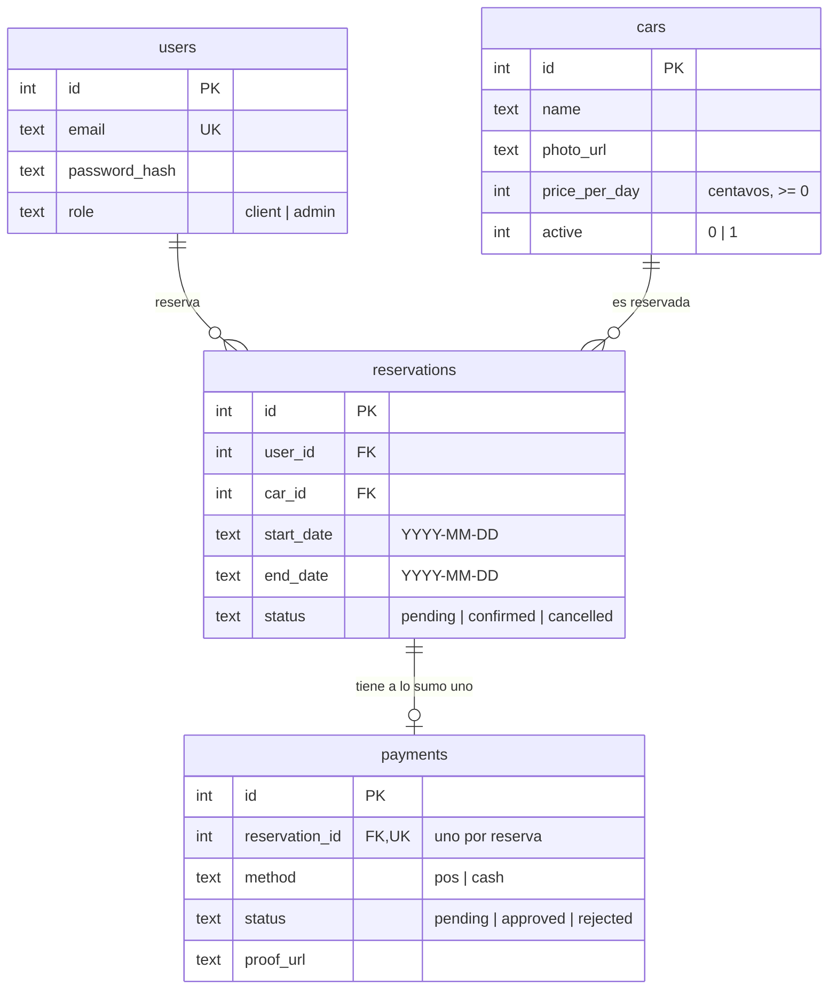
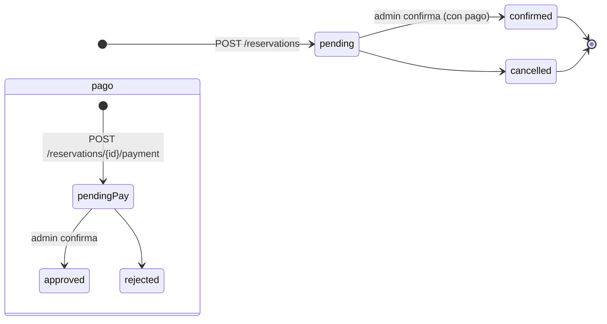

# Arquitectura

## Stack

- **Go 1.26** con la librería estándar: `net/http` (con las rutas con `Method` y
  placeholders, p. ej. `"PATCH /admin/cars/{id}"`), `database/sql` y `log/slog`.
- **SQLite** embebido vía `modernc.org/sqlite` (implementación 100% Go, no
  requiere CGO ni binarios externos).
- **JWT HS256** (`golang-jwt/jwt/v5`) y **bcrypt** (`golang.org/x/crypto`).
- **godotenv** (`joho/godotenv`) para cargar `.env` de forma opcional.

No hay framework web ni ORM: los handlers son `http.HandlerFunc` puros y las
consultas son SQL directo.

## Layout del repositorio

```
cmd/api/                  # main: configuración, servidor, middleware, graceful shutdown
internal/
  config/                 # carga y validación de variables de entorno
  db/                     # esquema SQLite, conexión, seed del admin, predicado de overlap
  auth/                   # bcrypt, JWT, middleware de autenticación y roles
  models/                 # tipos de dominio compartidos (User, Car, Reservation, Payment)
  handlers/               # API, rutas, middleware HTTP y handlers por recurso
  ratelimit/              # token bucket en memoria limitado por IP
scripts/                  # dev.sh y demo.sh
bruno/                    # colección API para Bruno
```

## Modelo de datos



Puntos clave del esquema (`internal/db/db.go`):

- `users.email` es único; `role` solo admite `client` y `admin`.
- `cars.price_per_day` está en **centavos** (entero) y no puede ser negativo.
- `payments.reservation_id` es único: **una reserva tiene a lo sumo un pago**.
- Las fechas son strings ISO `YYYY-MM-DD` en texto.

## Máquina de estados



- Una reserva nace en `pending`; el admin la confirma con `confirmed` tras
  aprobar el pago. La cancelación (`cancelled`) no se expone hoy vía API.
- Un pago nace en `pending`; pasa a `approved` cuando el admin confirma la
  reserva. Un pago `rejected` no tiene endpoint en el MVP.

## Reglas de dominio

Disponibilidad y solapamiento (`GET /cars`, `POST /reservations`):

- Solo se consideran autos con `active = 1`.
- Dos reservas solapan si `r.start_date <= fin AND r.end_date >= inicio`, siempre
  que ninguna esté `cancelled` (el overlap se evalúa con
  [`db.OverlapPredicate`](../internal/db/db.go)); las `cancelled` **no** bloquean.
- `start_date` no puede ser anterior a hoy (comparación UTC) y
  `end_date >= start_date`.

Validaciones de entrada:

- El body se limita a **1 MB** y es JSON estricto: campos desconocidos o JSON
  inválido → `400 "invalid JSON body"`; exceso de tamaño → `413`.
- `price_per_day` en el rango `0..100_000_000` centavos.
- `photo_url` y `proof_url`, si se envían, deben ser URLs HTTP/HTTPS válidas.
- Los emails se normalizan a minúsculas (trim incluido).
- El password mínimo es de 6 caracteres.

Operaciones atómicas:

- `POST /reservations` y `PATCH /admin/reservations/{id}/confirm` corren dentro
  de una transacción `BEGIN IMMEDIATE` (SQLite) para evitar carreras.

## Autenticación y autorización

- El login valida credenciales (bcrypt) y emite un **JWT HS256 de 24 h** con
  los claims `uid` (id de usuario) y `role`.
- `Authorization: Bearer <token>` en toda ruta protegida.
- Los middleware `RequireAuth` y `RequireRole` resuelven el usuario desde el
  token, lo cargan en la base y lo inyectan en el contexto de la request.
- Las rutas de admin requieren el rol `admin`; la app usa el patrón
  `Auth.RequireRole("admin", handler)` declarado en `Routes`.

## Rate limiting

- Token bucket **en memoria**, por IP (`RemoteAddr` sin puerto), solo para rutas
  cuyo path empieza por `/auth/`.
- Configuración actual: refill de `0.5` tokens/s (**30 por minuto**), ráfaga de
  `30`; sobre el límite → `429 {"error":"too many requests"}`.
- Es un límite de un solo proceso: **no es distribuido**. Los buckets expiran
  tras 10 min sin uso (GC cada minuto).

## Server y observabilidad

- `http.Server` con timeouts razonables (read header 5 s, read 10 s, write 30 s,
  idle 60 s) y `MaxHeaderBytes` 1 MB.
- `WithRequestLog` registra una línea por request con método, path, status y
  duración en ms usando `log/slog` (formato texto).
- Shutdown graceful ante `SIGINT`/`SIGTERM` con un límite de 10 s.
- Los errores internos se loguean con detalle y se devuelven como
  `500 {"error":"server error"}` sin filtrar detalles internos al cliente.

## Fuera de alcance (MVP)

Uploads reales de imágenes, gateway POS, integración con WhatsApp,
paginator, frontend, rate limiting distribuido y multi-instancia, y
cancelación de reservas vía API.